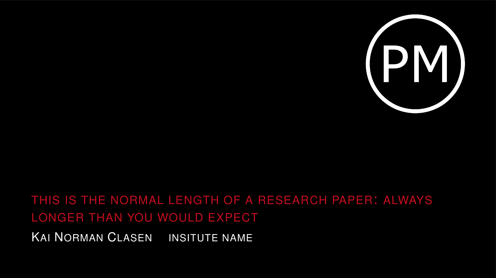
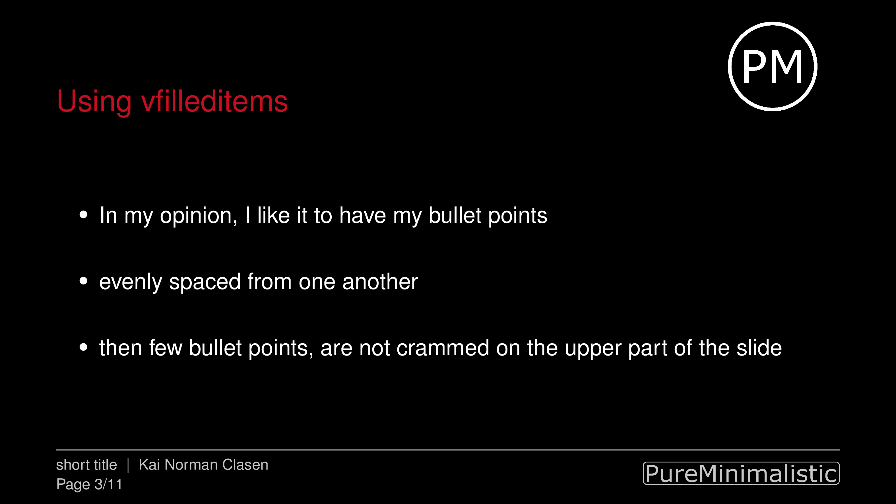
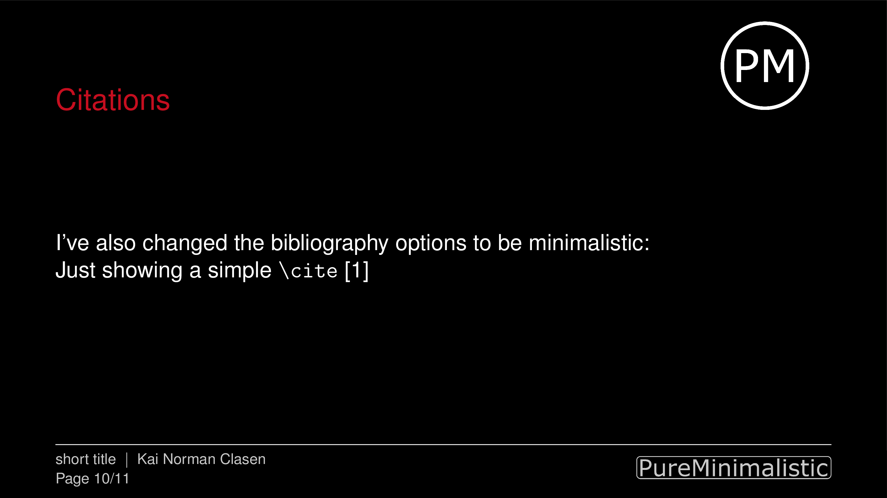

# 

[](https://github.com/kai-tub/latex_beamer_pure_minimalistic/releases) 
[](https://github.com/kai-tub/latex_beamer_pure_minimalistic/blob/master/LICENSE)


A presentation theme for LaTeX-Beamer that is truly
minimalistic, so that the focus is on the presenter and
not on the slides.

## Main goals
- No errors or warnings are produced by the theme
- It should be looking *good* in a 4:3 and 16:9 aspect
ratio, without the need to change anything.
- Provides an environment for vertical-spaced items
- Easy option to either use normal- or dark-mode
- Is designed to be purely minimalistic without any distractions 
- Easily use own logos (partly functional)
  

## Demo
A sample document can be seen in [demo.pdf](demo.pdf), produced
from [demo.tex](demo.tex).
The document shows all of the
design decisions, as well as some packages and commands that
work well for presentations. For example, starting the
frame counter after the *Table of Contents* section and not
including backup slides to the total frame counter.
Please use [demo.tex](demo.tex)
as a starting point, as exhaustive comments
were added to hopefully make everything very clear.

To add videos to the presentation, [pympress](https://github.com/Cimbali/pympress) is highly recommended.
This presentation tool works perfectly with
Beamer presentations and is available on all major OS!





# Download
Download the latest release by going to the [release page](https://github.com/kai-tub/latex_beamer_pure_minimalistic/releases).

# Instructions
After downloading, copy the files named
beamer*pureminimalistic.sty into the same folder as your
LaTeX source file. Then include the theme by writing
```latex
\documentclass[aspectratio=169]{beamer}

\usetheme[]{pureminimalistic}
```
 
## Customize Logos
Right now the theme expects the logos to be present in a
folder `logos` with the names: `header_logo`, `header_logo_darkmode`, `institute_logo` and `institute_logo_darkmode`. Currently, the best way to include
your logo is to replace these files and, if necessary, modify
the code where the figures are included in the
`beamerouterthemepureminimalistic.sty` file.

## Release status
The next steps and thoughts about the next release
with possible features can be seen on the [project
page](https://github.com/kai-tub/latex_beamer_pure_minimalistic/projects/1). 

# License
This software is released under the GNU GPL v3.0 
[License](LICENSE).

# Contact
If you have any comments, issues or suggestions, please
open an issue on GitHub. 
I will try my best to help as much as I can. :)